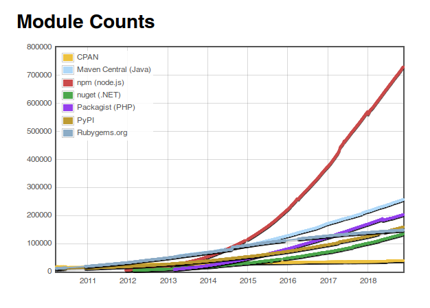
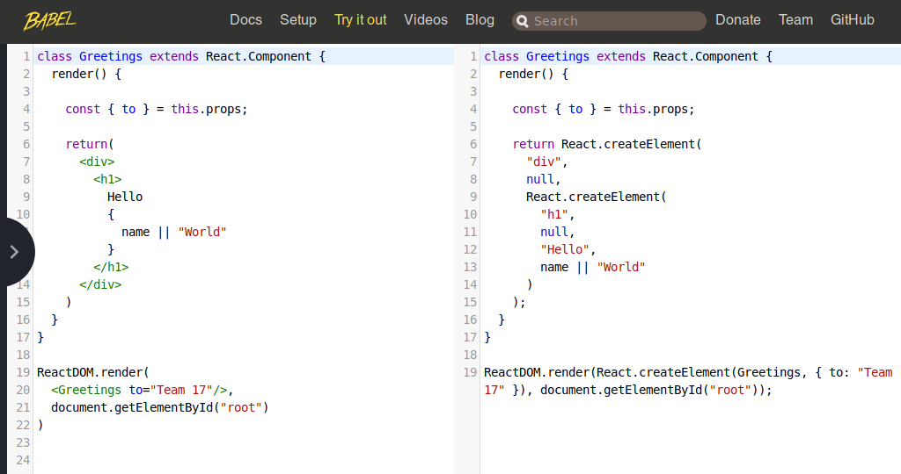

# Technologien, Konzepte und Libraries

## Einleitung

Diese Anleitung ist als Überblick in Technologien, Konzepte und Libraries im Umfeld on Automaton-Projekten gedacht.
Je nach Projekt-Rolle könnt ihr die Teile einfach als Zusammenfassung sehen, als auch als Ausgangspunkt beliebig
tiefer gehender Beschäftigung mit der Materie. 

## JavaScript/EcmaScript

Link: ???  
Referenz: https://developer.mozilla.org/de/docs/Web/JavaScript  
Kompatibilitätsprüfung: http://caniuse.com/

Modernes EcmaScript ist im Prinzip die fünfte oder sechste Javascript-Generation:

 * DHTLM-Hacks
 * Web 2.0 - AJAX und co, Browser-Kriege
 * Ecmascript 4 - Versuch XML zu integrieren und ein neues Klassenkonzept, gescheitert und aufgegeben
 * EcmaScript 5 - Nach den Browser-Kriegen die Phase der Standartisierung der WebAPIs. DOM Level 2/3, Canvas, WebGL
 * Ecmascript 6, später überführt als ES-2015, inkrementelle Evolution von EcmaScript 5,
   Einführung von Klassen, aber mit JavaScript-Prototype-Semantik
 * ... weitere inkrementelle Versionen

Parallel dazu die Evolution der Javascript-Entwicklungs-Methodik. Von Einzeldateien über bundler/minifier bis hin zu 
den heute üblichen, und auch von uns verwendeten Transpiler-Build-Chains.

## Node.js

( Siehe https://intern.quinscape.de/confluence/display/OA/DomainQL-Projeke )



Node.js ist der immens populäre Ansatz, Javascript aus dem Browser zu holen und mit einer eigenen Runtime-Engine zu einer
server-seitigen Sprache zu machen. Es besteht auch der V8-JavaScript engine von Google Chrome mit einer Reihe von Standard-Paketen.

Node.js dient als generelle runtime für unsere Build-Chain und darüber hinaus als Tooling-Sprache innerhalb des Projekts.
Bisher habe ich da immer shelljs verwendet, eine Betriebsystem-übergreifende Implementierung von UNIX tools in Javascript.
NPM

NPM ist eine Quasi-Standard zur Publikation von Node.js und anderen Modulen im Internet. Die NPM-Modul-Registry hat den
letzten Jahren ein stark exponentiales Wachstum gehabt und hat mittlerweile mit weitem Abstand die meisten Module irgendeiner Sprache.

Die generelle Entwicklungskultur geht hin zur absoluten Modularität mit manchmal lächerlichen Auswüchsen und Auswirkungen
([Left-Pad-Debakel](https://www.theregister.co.uk/2016/03/23/npm_left_pad_chaos/)).

Aber selbst bei konservativer Einbindung von Abhängigkeiten nach sorgfältiger Abwägung hat man, vor allem mit der
JavaScript Build-Chain, trotzdem einen Riesenhaufen Zeug rumliegen.

Unser gerade erst wachsende "Automaton-Test" hat zur Zeit 567 Abhängigkeiten, die 112MB umfassen – natürlich pro Projekt.

NPM ist auch ein Kommando-Zeilen-Tool zur Verwaltung der Abhängigkeiten wie sie in der package.json definiert sind.

Dieses Tool verwenden wir allerdings nicht, weil wir stattdessen yarn verwenden.

## Yarn

(Siehe https://intern.quinscape.de/confluence/display/OA/DomainQL-Projeke )

yarn ist ein NPM-Tool-Ersatz von Facebook, der schneller und zuverlässiger arbeitet in punkto Abhängkeitsauflösung und
reproduzierbaren Builds. NPM hat ein bisschen aufgeholt, yarn wirkt aber immer noch besser und hat außerdem das klar
besser Kommando-Zeilen-Interface.

Yarn ist prinzipiell in den Maven-Build integriert, so dass man sich generell nicht damit beschäftigen muss, wenn
man nur einen neuen Build erstellen will. Maven lädt dann eine lokale Version on Node.js und Yarn runter, aber das
läuft alles automatisch.

Dieser Build erzeugt allerdings einen Production-Bild, der bei der Entwicklung wenig hilfreich ist.

### Entwicklungs-Build

Um einen nicht-Production-Build zu erzeugen muss man entweder einmal

```sh
    yarn run build-dev
``` 

aufrufen, oder aber 

```sh
    yarn run watch
``` 

der einen Dev-Build erstellt und dann in einen Watch-Modus der fortwährend Js und CSS Änderungen transpiliert. 

## Webpack.

Link: https://webpack.js.org/

Webpack ist unser eigentliches Build-Tool. Wir definieren Einstiegspunkte und Webpack folgt den Abhängigkeiten, sowohl
statisch, wie auch dynamisch. Webpack verwaltet auch unser CSS.

Die `webpack.config.js` Datei im Projekt-Root konfiguriert den gesamten Webpack-Build mit allen Plugins uswusf.

In der `webpack.config.js` definieren wir die "Entry-Points" von denen Webpack aus alles zusammenpackt. Aus
der Automaton-Sicht sind dies einerseits der Login-Hilfsview, sowie die Eintritts-Punkte der unabhängigen apps.


Auszug aus der `webpack.config.js`: 
```js


// ... 

module.exports = {
    mode: process.env.NODE_ENV,
    entry: {
        "shipping": "./src/main/js/apps/shipping/shipping-startup.js",
        "login": "./src/main/js/login.js",
    },

    devtool: "source-map",

    // ...
} 

```


## Babel

Link: http://babeljs.io/

Babel vollzieht einerseits die Transpilations unseres ES2015+ JavaScript code nach EcmaScript 5 (zur Zeit), andererseits
hängen sich diverse unserer Plugins in den Webpack-Build und Babel ein, um Modell-Informationen aus dem
Babel-AST (Abstract Syntax Tree) zu extrahieren.

Die aktuelle Syntax in unserem Projekt benutzt:

 * ES2015 Klassen
 * JSX (React)
 * "Class Property Syntax"-Erweiterung
 * ES2015 legacy decorators (MobX)
 * "Object Rest Spread"
 * "Dynamic Import Syntax"
 * import / export Syntax

## CommonJS-Module / ES2015 Import/Export

Unser JavaScript-Code ist in Modul-Dateien organisiert, von denen jede einen isolierten Namensraum darstellt.
Statische Import und Export-Deklarationen verbinden die Module zueinander.

Darüber hinaus können mit System.import dynamisch Modul-Inhalte geladen werden, welche automatisch von Webpack in
getrennte JavaScript-Bundles überführt werden.

## React

Link: https://reactjs.org/

Wir benutzen mit React.js eine High-Level-Library um Seiteninhalte zu generieren. React benutzt eine XML-ähnliche Syntax.

Hier sehen wir die reine JSX-Transformation einer React-Grüß-Komponente.



Die JSX-Syntax ist lediglich syntaktischer Zucker für React.createElement()-Bäume, die deutlich schwerer lesbar sind.

Die render() Methode liefert einen Virtual DOM-Element-Baum zurück, der die aktuelle Repräsentation des 
Applikationszustands darstellt. 
Diese Virtual-DOM-Objekte sind keine vollständigen DOM-Objekte, sondern 
[Fliegengewichte](https://de.wikipedia.org/wiki/Fliegengewicht_(Entwurfsmuster)).

Wenn sich der Applikations-Zustand ändert (zum Beispiel, weil wir den React.DOM teil mit einem neuen "to" Attribut 
aufrufen), wird zuerst ein neues Abbild als Virtual-DOM erstellt, dass dann mit dem sogenannten 
[Reconciliation-Prozess](https://reactjs.org/docs/reconciliation.html) verglichen wird, so dass eine minimales 
tatsächliches Update erfolgen kann, dass aufgrund von 
[Reflow-Vermeidung](https://developers.google.com/speed/docs/insights/browser-reflow) usw deutlich performanter ist.

Darüber hinaus lässt sich der React-Element-Update-Prozess fein-granular auf Komponenten-Ebenen optimieren, um selbst 
den Reconciliation-Prozess zu beschleunigen.

React liefert ein allgemeines Komponenten-Modell und eine Menge darauf basierender Libraries und Technologien.

React arbeitet in vielen Belangen funktional. Das aktuelle UI ist eine funktionale Abbildung des aktuellen 
Applikationszustands.

React ist ebenfalls ursprünglich von Facebook entwickelt, wird aber mittlerweile überall verwendet. 
Netflix basiert auf React, Google Mail, JIRA, Instagram etc pp.

## Immutability

Ein wichtiges Konzept, dass auf dem Frontend durch React ins Spiel kommt, dass uns aber über die gesamte Tiefe der  Implementation begleitet: Immutability.

Während in Java eine Benutzung von unveränderbaren Klassen hauptsächlich aus Gründen der Concurrency geschieht, ist der Grund auf dem Frontend hauptsächlich
Aktualisierungsgeschwindigkeit.

Die Verwendung nicht-änderbarer Objekte erlaubt es den React-Komponenten, mit sehr billigen Instanz-Vergleichen große 
Bereiche der Seite während des Reconciliation-Prozesses auszuschließen.

Es gibt natürlich eine zusätzliche Komplexität, die durch die Verwendung von Immutability in den Code kommt. 
Diese versuchen wir teils mit JavaScript-Syntax-Zucker, teils durch Libraries einzudämmen.


## MobX

Link: http://mobx.js.org/

Nach einigem Hin- und Her haben wir uns gegen eine Verwendung von Redux als Zustands-Verwaltungs-Library entschieden 
und für Mobx.

Mobx benutzt ES2015 Proxies um magisch funktionierende Zustandsobjekte zu erzeugen. Code der so aussieht, als würde 
er einfach mutierende Veränderungen auslösen zum Beispiel

```js
    scope.currentObject.name = newName;    
```

läuft in Wirklichkeit gegen die MobX-Proxies, die dann aufgrund des etablierten Wissens über die aktuellen 
Datenabhängigkeiten diese Änderung geschehen lassen und fein-granular die nötigen Komponenten-Updates auszulösen.

## Bootstrap

Link: https://getbootstrap.com/

Bootstrap ist eine CSS-Library, die uns ein Grid-System, sowie einen einheitlichen Style innerhalb der Anwendung.

Boostrap 4 basiert immer noch auf jQuery, weswegen wir nur den CSS-Teil davon verwenden und für die Widgets dann "reactstrap".

### Semantische Klassen / Spacing

Wenn ihr Komponenten/JSX schreibt, macht euch bitte mit den semantischen Klassen von Boostrap vertraut, vor allem
in Sachen [Spacing](https://getbootstrap.com/docs/4.1/utilities/spacing/).

Wenn wir für Icons oder Buttons zum Beispiel `"mr-1"` verwenden, um einen minimalen Abstand an der rechten Seite
zu haben, so ist das aus vielerlei Gründen besser als Spaces oder noch schlimmer Spacer-GIFs zu verwenden.

```jsx harmony
    <Icon className="fab fa-quinscape mr-1"/>
```

Wir bleiben Font-unabhängig, wir können alle Paddings und Margins zentral definieren und der Look der Applikation
ist und bleibt homogen, auch wenn wir später das Padding erhöhen oder reduzieren.

## FontAwesome

Link: http://fontawesome.com/  
Suche: https://fontawesome.com/icons?d=gallery&s=brands,solid&m=free 

Seit Bootstrap 4 beinhaltet die Library keine Icons mehr, so dass wir mit FontAwesome eine weitere Library einbinden,
die uns diese als Webfonts liefert.

Wir benutzen zur Zeit die kostenlose Version der "solid" Icons und zusätzlich für unser Quinscape-Logo die "brands"
Icons.

### Icons finden
Wenn ihr für die Anwendung ein Icon sucht, dann benutzt am besten die [Fontawesome Suche](https://fontawesome.com/icons?d=gallery&s=brands,solid&m=free)

## Quinscape/Sven Libraries

Unsere eigenen Libraries teilen sich grob in drei Gruppen auf

## Maven Libraries

Libraries, die auf der Server-Seite in Java zum Einsatz kommen und sich in die Spring Boot Plattform integrieren.
 
### Spring-JsView

Link: https://github.com/quinscape/spring-jsview/

Spring-JsView implementiert einen client-seitige Spring WebMVC View. Dieser delegiert die tatsächliche Darstellung
komplett an das Frontend und beschäftigt sich hauptsächlich mit der Bereitstellung eines JSON-Daten-Blocks, der
mit in ein Minimal-HTML-Template eingebettet an den Client gesendet wird.

Diverse andere Libraries und Mechanismen klinken sich in diese Infrastruktur ein. ( Siehe de.quinscape.spring.jsview.JsViewProvider)
  
### DomainQL / Datenbankzugriff / Atomikos / JOOQ

DomainQL repo: https://github.com/quinscape/domainql

Wir benutzen [Atomikos JTA](https://www.atomikos.com/Main/TransactionsEssentials) als generellen JTA-Service-Provider, 
über den wir alle Datenbank-Zugriffe abwickeln. Dies erlaubt uns zukunftssicher beliebige Datenbanken und Messaging-
Services in diese zunächst nicht wirklich verteilten Transaktionen aufzunehmen. Der Overhead scheint für unsere
Belange erstmal generell vertretbar. Für unser Standard-Tomcat deployment stellt Atomikos eine JTA Umgebung bereit,
andernfalls integrieren wir uns mit einem Teil von Atomikos in die JTA-Infrastruktur des Application-Server.

#### Daten-Modellierung

Zur Zeit arbeiten wir noch SQL-schema first, auf lange Sicht werden wir uns normalerweise Richtung 
Domain-Model-First bewegen, außer bei legacy DB-Einbindungen.


Wir generieren in jedem Fall JOOQ Java-Klassen aus dem aktuellen Datenbank-Stand und ein GraphQL-Domäne auf
dieser Basis. Domänen-Daten und Prozessinformationen werden in JavaScript code übersetzt (WIP)

Die generierten JOOQ Klassen sollten wie immer nicht angefasst werden, sind sind halt da, sowohl in der POJOs we
auch mit speziellen Record Klassen.

Auf der Frontend-Seite kann der generierte Code modifziert werden und fließt wieder zurück nach OSEP.

Wir können bereits ein Domänen-Modell aus einer existierenden Datenbank auslesen, es aber bisher noch
nicht als Schema zurückschreiben (WIP). 

Die Automaton modelle sind im Vergleich zu OpenSAGA wesentlich heterogener und als JSON struktur abgelegt.

Teilweise ist die Modell-Klassen Struktur so designt, teilweise ist sie ein vereinfachtes Abbild eines Babel-AST
Baums vom Frontend.

Funktionalität wird entweder von automaton bereit gestellt oder muss als Komponenten und/oder Java Methoden
implementiert werden.

#### @GraphQLLogic / Query-Beispiel

Wie verwenden eine in Spring Boot integrierte annotationsgetriebene Methodologie der GraphQL-Konfiguration (DomainQL).
GraphQL an sich wird per graphql-java erledigt.  
  
```java
package de.quinscape.automatontest.runtime.service;

import de.quinscape.automatontest.domain.tables.pojos.Foo;
import de.quinscape.domainql.annotation.GraphQLField;
import de.quinscape.domainql.annotation.GraphQLLogic;
import de.quinscape.domainql.annotation.GraphQLQuery;
import de.quinscape.domainql.util.Paged;
import org.jooq.DSLContext;
import org.springframework.beans.factory.annotation.Autowired;

import java.util.List;

// XXX: Projekt-spezifischer JOOQ import
import static de.quinscape.automatontest.domain.Tables.*;

@GraphQLLogic
public class ExampleLogic
{
    private final DSLContext dslContext;

    @Autowired
    public ShippingLogic(
        DSLContext dslContext
    )
    {
        this.dslContext = dslContext;
    }

    @GraphQLQuery
    public Paged<Foo> getFoos(
        @GraphQLField(defaultValue = "0")
            int offset,
        @GraphQLField(defaultValue = "10")
            int limit
    )
    {
        final List<Foo> foos = dslContext.select()
            .from(FOO)
            .orderBy(FOO.CREATED)
            .offset(offset)
            .limit(limit)
            .fetchInto(Foo.class);

        final int countResult = dslContext.selectCount().from(FOO).execute();
        return new Paged<>(foos, countResult);
    }
}

```
@GraphQLLogic ist eine Spring-Meta annotation so dass Logik-Implementation automatisch gefunden und injected
werden soweit die entsprechenden component scans aufgesetzt sind.

Logik Implementationen können die komplette Breite der Spring Platform benutzen ( @Transactional etc )


Die Query-  und Mutations-Methoden wie hier `getFoos()` werden automatisch in die GraphQL-Domäne überführt.

GraphQL-Ausgabe:

```graphql schema
# Auto-generated from ExampleLogic
type QueryType {
  getFoos(offset: Int = 0, limit: Int = 10): PagedFoo
}
```  

PagedFoo entsteht durch die Degenerifizierung des Java-Typs Paged<Foo> und spiegelt als konkrete type instanz
die typ parameter wieder.

### Automaton

Link: https://intern.quinscape.de/bitbucket/projects/AUTO/repos/automaton/browse (noch)

Automaton bildet den organisatorischen und basis-implementierenden Rahmen für per OSEP generierte DomainQL
applikationen.

Es ist der OpenSAGA-artigste Teil des ganzen. Definiert ein Standard-applikationslayout das sich mit handgeschriebenem
Frontend-Code integrieren soll.

## Frontend Libraries

JavaScript-Libraries die wirklich Teil des Frontends sind, das an den Client gesendet wird.

### Automaton-Js

Link: https://intern.quinscape.de/bitbucket/projects/AUTO/repos/automaton-js/browse (noch)

Begleit-Library zu dem Maven-Projek automaton, der Frontend-Teil der Automaton Grund-Funktionalität.

### DomainQL-Form

Link: https://github.com/quinscape/domainql-form

DomainQL Form implementiert Formulare auf Basis eines reflektierten GraphQL-Schemas, reactstrap und MobX.

### jsview-bootstrap

Link: https://github.com/quinscape/jsview-bootstrap

Mini-Modul das initiale React-boostrapping mit den DomainQL-Daten abwickelt. Kann für Minimal-Views auch
alleine verwendet werden.

Taucht auch innerhalb unseres -startup.moduls auf.

## Tooling Libraries

Libraries, die Tooling rund um den Build-Prozess und Source-Code Analyse-Prozesse. 

### babel-plugin-automaton

Link: https://intern.quinscape.de/bitbucket/projects/AUTO/repos/babel-plugin-automaton/browse (noch)

Extrahiert Modell-Informationen aus dem Babel-AST.

### babel-plugin-track-usage

Link: https://intern.quinscape.de/bitbucket/projects/XCD/repos/babel-plugin-track-usage/browse (noch)

In der Exceed-Phase enstandenes plugin um innerhalb einer transpilten JavaScript-Code-Base statisch die Funktionsaufrufe bestimmter 
service module zu verfolgen.

In Automaton benutzen wir dies für die Übersetzungen (i18n() Funktion) und für die injections in "Observable"-Objekte.

### jsview-webpack-plugin

Link: https://github.com/quinscape/jsview-webpack-plugin 

Extrahiert informationen zu den Webpack-Bundles für die Server-Seite, damit diese weiss, welche Ressourcen zu
den jeweiligen Entry-Points gehören.

### domainql-webpack-plugin

Link: https://github.com/quinscape/domainql-webpack-plugin 

Support für PRELOADED_QUERIES, einer statischen Alternative zu unseren "Observable"-Objekt injections.

Wenn man im Entry-Point eine Definition ala

```jsx harmony

export const PRELOADED_QUERIES = {
    
    // language=GraphQL
    myQuery: `...`
}
```
erhält man das Resultat der GraphQL-Query als Teil der initialen Daten. Im Prinzip reines DomainQL an dem
Automaton-System vorbei.
 

